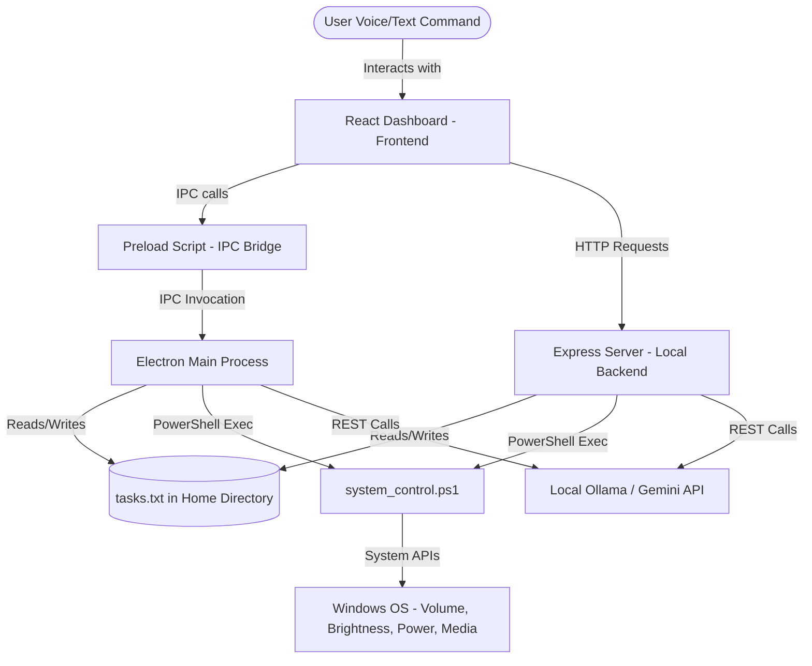

# VoicePilot: Working Principle & Functionality Document

This document details the architectural design, working principles, native system integrations, and complete functionality of **VoicePilot** (the desktop assistant). It also outlines the mechanics of the task list manager—including the newly added quick task cleaning features.

---

## 1. Project Overview & Tech Stack

**VoicePilot** is an offline-first, cyberpunk-themed desktop assistant that merges a React-based frontend dashboard with a native Windows utility backend. It allows users to control volume, screen brightness, system power states, media playback, and tasks using voice or text commands, with a local/cloud AI fallback.

### Tech Stack Components:
* **Frontend**: React 19, Vite, TailwindCSS (for sleek, matrix-green styling), Framer Motion (for micro-animations), Lucide React (icons).
* **Electron Shell**: Serves as the primary desktop wrapper with access to node APIs, IPC communication, and keyboard global shortcuts.
* **Local Express Server**: Run on Node.js/TypeScript (`server.ts`) to expose REST APIs for system telemetry, hardware control, and tasks.
* **OS Integration Engine**: Custom PowerShell controller (`system_control.ps1`) executing native Windows OS calls.
* **Core Intelligence**: Hybrid AI agent model routing queries to local **Ollama** (`qwen2.5-coder:7b`) or **Google Gemini API** (`gemini-2.5-flash`).

---

## 2. Architecture & Working Principle

VoicePilot uses a hybrid architectural style to bridge sandboxed web frontends with native OS hardware.

### Flow of Execution:
1. **Command Input**: The user says a phrase (captured via Chrome Web Speech API / local speech engine) or types in the terminal console.
2. **Direct Command Parser**: The frontend runs a regex-based parser. If the phrase matches local rules (e.g., *"mute"*, *"clear completed"*), it executes instantly.
3. **AI Agent Parser**: If the phrase is unrecognized, it routes to the Local/Cloud AI Agent. The agent returns a structured JSON payload detailing thoughts, targeted actions, and a verbal response.
4. **Native Execution**: Actions are executed by spawning a PowerShell instance running `system_control.ps1` with bypass policies.

---

## 3. Functionality & Core Features

### 🔊 System & Hardware Control
* **Volume Management**: Query or adjust master sound volume (0-100%). Toggle system mute.
* **Brightness Control**: Scale display backlight brightness dynamically.
* **Media Playback**: Play, pause, skip, or reverse media tracks.
* **App Launchers**: Instant dispatch calls to open native accessories (`Notepad`, `Calculator`), user folders (`Downloads`), or URLs in the default browser.

### 🔌 System Power Macros
* **Lock Screen**: Instantly lock the workstation.
* **Sleep Mode**: Put the host PC to sleep.
* **Shutdown & Restart**: Schedules action with a 15-second grace window and native toast alerts.
* **Abort Sequence**: Emergency cancellation of pending shutdown/restart procedures.

### 🔔 Native Toast Notifications
All major triggers dispatch native Windows toast alerts using PowerShell's WinRT interface (`Microsoft.Windows.Shell.RunDialog` or `ToastNotificationManager`), alerting users when tasks are scheduled, done, or deleted without leaving the application open.

---

## 4. Task List Management (Notepad Integration)

The Task List is maintained through an offline file-based approach. The app reads and updates a flat-file called `tasks.txt` located in the user's root home directory (`%USERPROFILE%/tasks.txt`).

> [!NOTE]
> This approach keeps your data 100% private, human-readable, and editable in standard text editors like Notepad without databases.

### Task File Syntax
Tasks are saved as line items in the text file using standard Markdown checkbox format:
* `[ ] Buy groceries` -> Pending Task
* `[x] Complete project roadmap` -> Completed Task

### File Read/Write Mechanics
1. **Reading**: The system reads the file line by line, parses the checkmark `[x]` to assign `completed` status and `[ ]` to assign `pending` status, and increments integer IDs starting at `1`.
2. **Writing**: The system transforms the active task array back into string markers (`[ ]` or `[x]`) and overwrites the file contents.

### Core Task Functions
* **Load/Refresh**: Polls the file and updates the React state.
* **Add Task**: Appends a new item to `tasks.txt` in a pending state.
* **Toggle Task**: Flips the checkbox prefix status between `[ ]` and `[x]`.
* **Delete Task**: Filters out the specific task and updates the file.
* **Open in Notepad**: Spawns a native Notepad shell highlighting the physical text file so you can edit it directly.

### ⚡ Newly Added: Quick Clear Functionalities
To optimize task management, the following functions have been implemented to easily clean up the task file:

1. **Clear Completed Tasks**:
   * **UI Button**: Active `CLEAR COMPLETED` button in the Task Manager widget header.
   * **Voice Command**: Recognizes commands like *"clear completed tasks"*, *"clear completed"*, or *"delete completed tasks"*.
   * **AI Action**: Employs `task_clear_completed` JSON action within the AI agent router to wipe completed items offline.
2. **Clear All Tasks**:
   * **UI Button**: Active `CLEAR ALL` button with a confirmation popup.
   * **Voice Command**: Recognizes *"clear all tasks"*, *"clear tasks"*, or *"delete all tasks"*.
   * **AI Action**: Employs `task_clear_all` JSON action to clear the entire list.

---

## 5. Offline Commands & Voice Phrases Reference

Here is a reference table of the direct local commands you can say or type:

| Command Group | Spoken/Written Phrase | Action Taken |
| :--- | :--- | :--- |
| **System** | `volume up` / `increase volume` | Raises master volume by 10% |
| | `volume down` / `quieter` | Lowers master volume by 10% |
| | `mute` / `unmute` | Toggles master speaker mute state |
| | `brightness up` / `brighter` | Increases display brightness by 10% |
| | `lock pc` / `lock screen` | Locks the Windows workstation |
| | `sleep pc` / `sleep` | Puts the PC into sleep mode |
| | `shutdown pc` | Schedules system shutdown |
| | `abort shutdown` / `abort` | Aborts pending shutdown / restart |
| **Launcher** | `open notepad` / `notepad` | Launches native Notepad.exe |
| | `open calculator` / `calc` | Launches Calculator |
| | `open browser` | Launches default web browser |
| **Tasks** | `add [title] to tasks` | Adds new task with the specified title |
| | `complete task [id/title]` | Marks task as completed |
| | `delete task [id/title]` | Removes task from the file |
| | `show tasks` / `list tasks` | Reads pending tasks list via Speech TTS |
| | `clear completed tasks` | Removes all `[x]` checked tasks |
| | `clear all tasks` | Empties the entire tasks file |
| | `open tasks file` | Opens `tasks.txt` directly in Notepad |
| **Telemetry** | `system stats` / `telemetry` | Reads CPU, RAM, and Disk capacity percentages |
